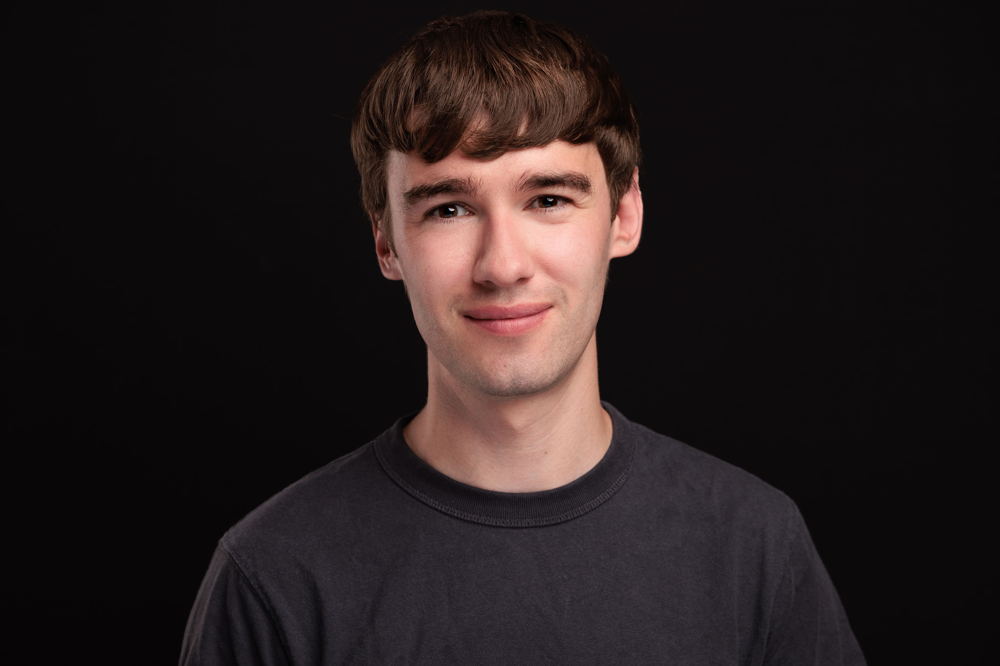

I'm a software engineer based in Cambridge Massachusetts.

# Work

I currently work at Formlabs, a manufacturer of 3D printers. Formlabs builds [SLA](https://formlabs.com/blog/ultimate-guide-to-stereolithography-sla-3d-printing/) and [SLS](https://formlabs.com/blog/what-is-selective-laser-sintering/) printers, with a goal of improving the accessibility of these advanced manufacturing techniques. I'm a software technical lead, [spearheading work on selective laser sintering](https://www.linkedin.com/feed/update/urn:li:activity:7164683477626404864/). I lead a team that focuses on improving print mechanical properties, print yield and process throughput.

# Education

I attended Canada's University of Waterloo for my BASc in Systems Design engineering. I specialized in software and sensing systems. Throughout my undergrad I completed six four month internships, which provided me with a wide variety of industry experience. These internships were a springboard for my career and they paid for my education. I'm a big advocate for the cooperative education program, and I continue to mentor current students.

# Interests

I'm an enthusiastic outdoor adventurer. On the weekends I volunteer with the MIT outing club as a community leader. In this role I facilitate rock climbing, ice climbing and hiking outings. 

I love third places, and I spend a lot of time supporting and assisting community building organizations. A current volunteer project of mine involves building out an outdoor gear lending library in my local community.
